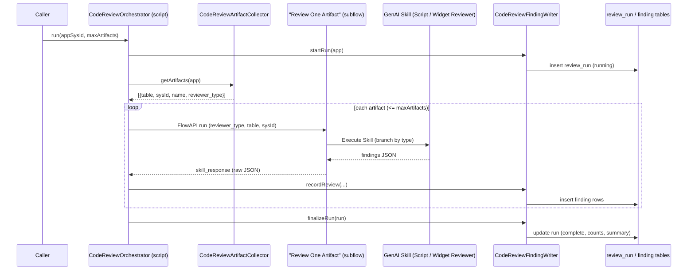
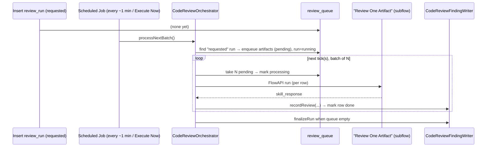

# GenAI Code Review — Orchestrator Design

> **Design document** for the Phase 4 orchestrator: how a single application review runs
> end-to-end. Companion to `genai-code-review-implementation-plan.md` (state/sequencing),
> `genai-code-review-skill-scope.md` (what & why), and `TestResult.md` (validation).
>
> Status: **Phase 4 built and validated end-to-end (AssetFlow + Novel Jewels). Async execution
> layer (queue + scheduled worker) designed and agreed — see §3A; build pending.**

---

## 1. Purpose

Turn a single input — an **application sys_id** — into a complete, persisted, per-application
code review: every supported artifact in the app is reviewed by the right GenAI skill, and every
finding is written to a table for reporting and action.

---

## 2. Guiding principle — a "dumb" subflow, a "smart" script

The design splits work by **what each platform tool can actually do**:

| Concern | Lives in | Why |
|---|---|---|
| Create run, enumerate artifacts, loop, **parse JSON**, write findings, finalise | **Script Include** (Fluent) | Flows are declarative and cannot parse JSON or run arbitrary logic; script is also unit-testable via `run_script` and versioned in source |
| The **skill invocation** itself (Execute Skill) | **Subflow** (Flow Designer) | Invoking a skill is only supported through the "Execute Skill" flow action; it has no Fluent representation |

> **The subflow is deliberately minimal: `type in → skill output out`.** It makes no decisions
> beyond routing to the correct skill, and it does **not** touch the database. All intelligence
> (parsing, validation, persistence, batching, error handling) stays in the Script Include.

This keeps the UI-built surface as small as possible (one tiny subflow) and the testable,
source-controlled surface as large as possible (everything else).

---

## 3. End-to-end sequence

```
Input: application sys_id  (+ optional maxArtifacts guard)
   │
   ▼
CodeReviewOrchestrator (Script Include)
   │
   ├─ 1. startRun(app)            → CodeReviewFindingWriter.startRun()
   │        creates x_rptp_ai_code_rev_review_run (status = running)
   │
   ├─ 2. enumerate                → CodeReviewArtifactCollector.getArtifacts(app)
   │        → [{ source_table, sys_id, name, reviewer_type }, ...]
   │
   ├─ 3. FOR EACH artifact (up to maxArtifacts):
   │        │
   │        ├─ 4. call subflow "Review One Artifact"  via sn_fd.FlowAPI.getRunner()
   │        │        inputs:  reviewer_type, source_table, artifact_sys_id
   │        │        │
   │        │        └─ (inside subflow) branch on reviewer_type:
   │        │               sp_widget → Execute Skill → Service Portal Widget Reviewer
   │        │               else      → Execute Skill → Script Code Reviewer
   │        │        output: skill_response (raw JSON string)
   │        │
   │        └─ 6. CodeReviewFindingWriter.recordReview(run, app, table, id, name, skill_response)
   │                 parse JSON (tolerant of fences/prose) → validate → insert finding rows
   │
   └─ 7. finalizeRun(run)         → CodeReviewFindingWriter.finalizeRun()
            status = complete, artifact_count, finding_count, severity summary
```

(Step numbers match the walkthrough agreed with the product owner; step 5 — "the skill produces
findings" — happens inside step 4's Execute Skill.)

### Mermaid view



---

## 3A. Asynchronous execution model (queue + scheduled worker)

Section 3 describes the **synchronous** path (`run(app, maxArtifacts)`) — ideal for small apps and
testing, but bounded by a single transaction: a full app (LOS = 112 artifacts = 112 LLM calls)
cannot complete in one foreground execution. The async model removes that ceiling.

### Principle: break the work into small, resilient units

Instead of one long transaction looping every artifact, the work is split across many short
executions driven by a **queue** and a **scheduled worker**:

```
1. START      Insert x_rptp_ai_code_rev_review_run (status = requested, application set)
                 └─ trigger: Scheduled Job "Execute Now", a UI action, or a manual insert

2. ENQUEUE    Worker sees a "requested" run → enumerates artifacts →
                 inserts one x_rptp_ai_code_rev_queue row per artifact (state = pending) →
                 sets run status = running

3. PROCESS    Worker takes the next BATCH (default 5) of pending rows:
                 flip pending → processing (concurrency guard) →
                 call subflow → recordReview → mark row done (or error + message)
                 One execution ≈ 5 LLM calls → comfortably inside one transaction

4. CONTINUE   Rows still pending?  → next scheduled tick resumes where it left off
              Queue empty?         → finalizeRun (status = complete, severity summary)
```

### Why a queue table (not a background flow loop)

| Property | Queue + worker | One long background flow/loop |
|---|---|---|
| Transaction size | ~5 LLM calls per tick | ~112 calls in one run |
| Resumable | Yes — state persists per row | No — a crash loses the run |
| Failure isolation | One row → `error`, rest continue | One failure can sink the whole run |
| Progress visibility | pending / processing / done / error counts | Opaque until it finishes |
| Scales to any app size | Yes | Fragile beyond a few dozen |

### Worker mechanism: Scheduled Job

A single **Scheduled Job** (`sysauto_script`) does everything, driven purely by the existence of
run/queue records — no business rules or events needed:

- For each **requested** run → enqueue its artifacts (up to `maxArtifacts`), set `running`.
- For each **running** run → process the next pending batch; when its queue is empty → finalize.

**On-demand runs** use the job's built-in **Execute Now** — so "review this app now" needs no
separate trigger. Chosen over event-driven self-continuation for reliability and simplicity;
the only trade-off is up to one scheduling interval of latency between batches.

### Mermaid view (async)



### Concurrency & idempotency
- Rows move `pending → processing → done/error`; a worker only claims `pending` rows and flips
  them to `processing` before calling the skill, so overlapping ticks never double-process.
- A run is finalised only when it has zero `pending`/`processing` rows.

### Tunables (system properties or job config)
- **Batch size**: 5 artifacts per tick.
- **Frequency**: every ~1 minute.
- **maxArtifacts**: cap on enqueue per run (default 25; raise/remove for full-app runs).

---

## 4. Component responsibilities

| Component | Type | Responsibility | Status |
|---|---|---|---|
| `CodeReviewOrchestrator` | Script Include (Fluent) | `run(app, max)` synchronous path (built). To add: `requestReview(app, max)` (create run) + `processNextBatch()` (paced worker: enqueue, claim batch, call subflow, record, finalise). | ✅ `run()` built; async methods **to build** |
| `Review One Artifact` | Subflow (Flow Designer → synced) | Branch by `reviewer_type`; call the correct **Execute Skill**; return the review Object. No DB access. | ✅ Built (UI) + synced |
| `CodeReviewArtifactCollector` | Script Include | Enumerate app artifacts + routing key. | ✅ Built |
| `CodeReviewFindingWriter` | Script Include | `startRun` / `recordReview` (parse + validate + persist) / `finalizeRun`. | ✅ Built + tested |
| `CodeReviewScriptGatherer` | Script Include | (Used by the Script skill's tool) gather script/REST/UI-Page code. | ✅ Built |
| `CodeReviewWidgetGatherer` | Script Include | (Used by the Widget skill's tool) gather widget surfaces. | ✅ Built |
| `CodeReviewPreScanner` | Script Include | (Used by gatherers) full-text marker scan + size tiers. | ✅ Built |
| `Script Code Reviewer` | GenAI Skill | Reviews scripts, Scripted REST, UI Pages. | ✅ Live |
| `Service Portal Widget Reviewer` | GenAI Skill | Reviews `sp_widget`. | ✅ Live |
| `x_rptp_ai_code_rev_queue` | Table | One row per artifact awaiting/undergoing review (run, source_table, source_id, artifact_name, reviewer_type, state, message). | Async — **to build** |
| Code Review Worker | Scheduled Job (`sysauto_script`) | Every ~1 min (and on **Execute Now**): enqueue requested runs, process the next pending batch via `processNextBatch()`, finalise completed runs. | Async — **to build** |

---

## 5. Contracts

### Subflow: `Review One Artifact`
- **Inputs (String):** `reviewer_type`, `source_table`, `artifact_sys_id`
- **Output (String):** `skill_response` — the skill's raw JSON text
- **Logic:** `if reviewer_type == 'sp_widget'` → Execute Skill *Service Portal Widget Reviewer*
  (`widgetSysId = artifact_sys_id`); `else` → Execute Skill *Script Code Reviewer*
  (`sourceTable = source_table`, `artifactSysId = artifact_sys_id`).

### Orchestrator: `CodeReviewOrchestrator`
- **Entry:** `run(appSysId, maxArtifacts)` — `maxArtifacts` default ~25 to cap cost/time on a first
  run (a full LOS review is ~112 skill calls).
- Invokes the subflow via `sn_fd.FlowAPI.getRunner()` (confirmed available at runtime).

### Reviewer JSON output (both skills, identical — maps 1:1 to the finding table)
```json
{
  "artifact": "name",
  "artifact_type": "Business Rule",
  "overall_assessment": "1-2 sentences",
  "findings": [
    { "severity": "critical|high|moderate|low",
      "category": "hardcoding|security|performance|maintainability|best_practice",
      "issue": "...", "recommendation": "...", "line_reference": "..." }
  ]
}
```

---

## 6. Data model

- **`x_rptp_ai_code_rev_review_run`** — one row per execution: application, status
  (`requested`/`running`/`complete`/`error`), started/finished, artifact_count, finding_count, summary.
- **`x_rptp_ai_code_rev_finding`** — one row per issue: review_run, application (denormalised for
  per-app grouping), artifact_type, source_table, source_id, artifact_name, severity, category,
  issue, recommendation, line_reference, raw_response.
- **`x_rptp_ai_code_rev_queue`** *(async)* — one row per artifact to review: review_run,
  source_table, source_id, artifact_name, reviewer_type, state
  (`pending`/`processing`/`done`/`error`), message. Drives the paced worker and gives live progress.

Per-application reporting = group `finding` by `application` (and/or `severity`, `artifact_type`),
mirroring how Instance Scan groups by package.

---

## 7. Design decisions & rationale

| Decision | Rationale |
|---|---|
| Hybrid (subflow + script), not pure-Fluent-flow | The Execute Skill step cannot be authored in Fluent (confirmed via docs + search). |
| Hybrid, not pure-script | Invoking a skill from server script would rely on internal/unsupported APIs; the flow action is the sanctioned path. |
| Subflow does no DB work | Flows are declarative — parsing JSON and writing rows belongs in script; also keeps the orchestrator fully `run_script`-testable. |
| One artifact per skill invocation | LLM context limits; precise per-artifact attribution; failure isolation. |
| Deterministic routing (by `reviewer_type`) | The mapping is known — paying an LLM to route would be slower, costlier, less reliable. |
| `maxArtifacts` guard | A full LOS review is ~112 LLM calls; a batch cap controls cost/runtime and supports incremental runs. |
| Unparseable skill output → explicit finding | Never silently drop an artifact; a bad response is itself a recordable, visible problem. |
| Async via queue + scheduled worker (not one long background flow) | Keeps each transaction to ~5 LLM calls; resumable, failure-isolated, progress-visible, scales to any app size. |
| Scheduled Job worker (not event-driven) | Simplest and most reliable to build in Fluent; "Execute Now" covers on-demand runs. Trade-off: up to one interval of latency between batches. |
| Trigger = insert a `review_run` (status `requested`) | Decouples "ask for a review" from "do the review"; works from a UI action, a schedule, or a manual insert, with no bespoke trigger plumbing. |

---

## 8. Open questions

- ~~**Trigger**~~ **RESOLVED** — insert a `review_run` (status `requested`); a Scheduled Job enqueues
  + processes it, with **Execute Now** for on-demand runs (§3A).
- **Findings-driven mode:** optionally seed the loop from Instance Scan `scan_finding` source records
  instead of full enumeration, to focus and cut cost.
- **Re-run behaviour:** supersede prior findings for the same app, or keep full history per run?

---

## 9. Build sequence

**Done (synchronous path):**
1. ✅ `Review One Artifact` subflow built in Flow Designer + synced.
2. ✅ `CodeReviewOrchestrator.run()` authored, installed, validated end-to-end on AssetFlow (2) and
   Novel Jewels (6 — scripts + widgets).

**Next (async path — §3A):**
3. Create `x_rptp_ai_code_rev_queue` table.
4. Extend `CodeReviewOrchestrator` with `requestReview(app, max)` (create run + enqueue) and
   `processNextBatch()` (claim batch → subflow → recordReview → finalise when queue empty).
5. Create the **Code Review Worker** Scheduled Job calling `processNextBatch()` (every ~1 min; Execute Now for on-demand).
6. Declare any new cross-scope privileges surfaced at runtime; test a full-app async run (e.g. LOS 112); update plan + TestResult.
